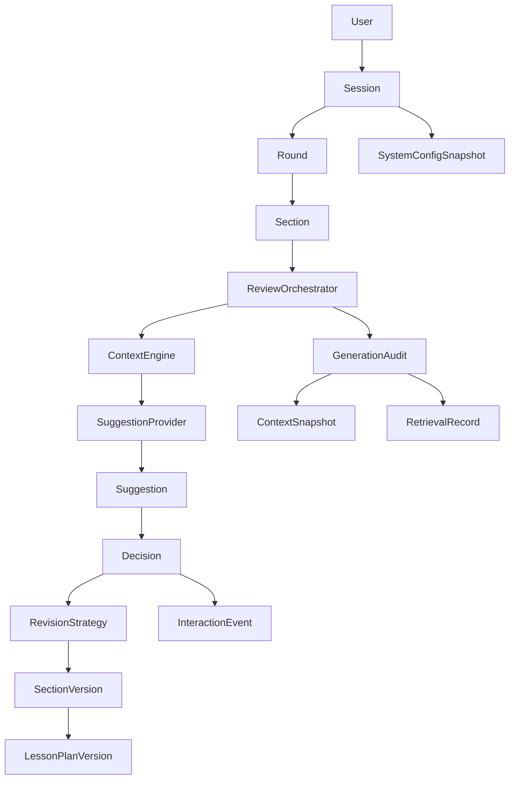
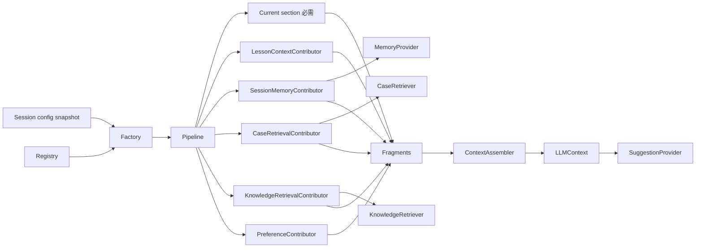
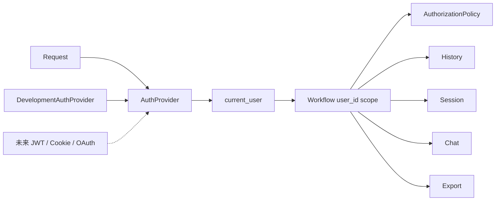

# PedagoLoop usable alpha / internal pilot

交付日期：2026-09-28。保留原有 Section review、最多五轮、版本、幂等提交与刷新恢复；新增可配置上下文、ownership、数据核验和研究记录。**真实模型端到端验收尚待密钥；本机 PostgreSQL 实例尚未验收。** 这不是正式实验版本。

## 1. 核心架构



Workflow 负责状态迁移、权限范围、事务与版本；Orchestrator 只协调上下文、生成、审计。新会话使用 v2 pipeline，旧 v1 会话继续旧策略。拒绝不改正文；每轮结束保存版本；第六轮被拒绝。SessionRecovery 由数据库状态重建接口承担，不另建重复状态存储。

## 2. Plugin / Contributor 架构



Assembler 不查询数据库，也不依赖任何具体 retriever；SuggestionProvider 只接收 LLMContext，不负责检索。增加 contributor 不改 Session/Round/Section 或 Orchestrator。

## 3. User / Auth 架构



## 4. 修改文件

- 核心：`backend/app/models.py`、`api.py`、`workflow.py`、`history.py`、`orchestrator.py`、`schemas.py`、`settings.py`。
- 新模块：`auth.py`、`context.py`、`context_engines.py`、`contributors.py`、`retrieval.py`、`dataset.py`、`audit.py`。
- Provider：`providers/interfaces.py`、`config.py`、`llm.py`；新增 `alpha.py`、`registry.py`、`revision.py`。
- 迁移：`backend/migrations/env.py`、`versions/f3cc62ac42cf_alpha_foundation.py`。
- 前端：`frontend/src/App.vue`、`style.css`；历史列表、资料状态、真实来源展示、替换候选确认。
- 工具：`scripts/dataset.py`、`knowledge.py`、`assign_legacy.py`、`smoke_llm.py`。
- 验证：`backend/tests/test_alpha.py`、`test_contracts.py`、`test_migrations.py`；`frontend/tests/workflow.spec.js`、`playwright.config.js`。
- 配置和文档：`.env.example`、`.env.zhipu.example`、`README.md`、本文件、`architecture.md`、`validation.md`。

## 5. 新增表

| 表 | 用途 |
|---|---|
| users | UUID 身份、username、可空 password_hash、role、时间 |
| system_config_snapshots | 每会话冻结配置，不保存密钥 |
| lesson_overviews | 一次生成的教案概览、目标/活动/评价摘录 |
| conversations / chat_messages | 服务端会话消息与关联单元/建议 |
| user_preferences | 按用户存储的未来偏好结构 |
| context_snapshots | 每次模型输入与来源追踪 |
| dataset_items / dataset_annotations | 原始资料及批注，保留 raw payload |
| dataset_verifications | 显式五项人工核验及核验人、说明 |
| case_items | 通过核验并被显式提升的案例 |
| knowledge_items | 独立的规范性知识和来源定位 |

共 12 张新表。原有用户业务表全部增加 user_id；Suggestion 增加 issue_type、scope、confidence、revision_mode、target_text、knowledge_ids、basis_sources；RetrievalRecord 增加查询、过滤器、项目 ID、分数、类型与 top_k。

## 6. 迁移与旧数据

新增 revision `f3cc62ac42cf`，继承 `905cf71efaee`，未修改原始 migration。执行：

```powershell
./.venv/Scripts/python.exe -m alembic -c backend/alembic.ini upgrade head
```

已升级本机 `pedago_loop.db`；升级前备份在 `.runtime/pre_alpha_backup.db`。升级前后原有列逐行比对一致，外键检查无错误，SQLite CHECK 约束保留；`alembic check` 无差异。downgrade 不删除研究记录，需要停服并从备份恢复。

旧数据统一标记到 `legacy-import` 用户，避免凭空推断真实 owner。当前 development 用户默认看不到这些旧记录。确认旧数据归属后，可在本机显式运行：

```powershell
./.venv/Scripts/python.exe scripts/assign_legacy.py --username development
```

该工具将所有 legacy-import 业务记录整体分配给指定用户；不适用于把混合来源数据拆分给多位真实用户。交付时未执行此分配。

## 7. Interfaces

新增 AuthProvider、ContextContributor、ContextPolicy、Retriever、EmbeddingProvider、PreferenceProvider；新增 ContextBuildRequest、ContextFragment、RetrievalQuery、RetrievalItem、RevisionResult。保留 SectionParser、MemoryProvider、SuggestionProvider、RevisionStrategy。SuggestionProvider 统一 `generate(context)`；RevisionResult 支持 applied/candidate。

## 8. Registry / Factory

`CapabilityRegistry` 注册 parser、revision 和 contributor 构造器；`ExperimentConfigFactory` 从会话快照创建配置。Memory/retriever 工厂映射位于组合层；Auth 使用独立 `AUTH_PROVIDERS` 注册表，也可通过 `create_app(..., auth_provider=...)` 注入。替换实现只改组合层，核心业务不用改。

## 9. 默认启用的 Contributors

```dotenv
CONTEXT_CONTRIBUTORS=["lesson_context","session_memory","knowledge_retrieval","case_retrieval"]
MEMORY_PROVIDER=rule_based
CASE_RETRIEVER=metadata
KNOWLEDGE_RETRIEVER=metadata
RETRIEVAL_TOP_K=3
MAX_CONTEXT_TOKENS=12000
SECTION_PARSER=bounded_v2
REVISION_STRATEGY=replace_or_append_v2
AUTH_PROVIDER=development
DEVELOPMENT_USERNAME=development
```

Preferences 默认关闭；即使启用，当前 NoPreferenceProvider 也返回空。Current section 为核心必需片段，不能通过 contributor 列表关闭。

## 10. 关闭 Contributor

例如去掉案例检索：

```dotenv
CONTEXT_CONTRIBUTORS=["lesson_context","session_memory","knowledge_retrieval"]
```

全部可选能力关闭可设 `[]`。修改 `.env` 后重启并创建新会话；已有会话保持原配置。也可将 CASE_RETRIEVER / KNOWLEDGE_RETRIEVER 设为 `none`，或 MEMORY_PROVIDER 设为 `none` / `reject_only`，测试不同实现。

## 11. 新增 Contributor

```python
class ExampleContributor:
    def contribute(self, request):
        return ContextFragment(
            contributor_type="example", content={"hint": "明确说明来源"},
            source_ids=[], priority=70, retention_priority=70)

registry = default_registry()
registry.register("example", lambda history, snapshot: ExampleContributor())
factory = ExperimentConfigFactory(settings, registry)
```

把 `example` 加进新会话的配置列表，并在 app 组合层使用该 factory。Contributor 访问用户历史时必须使用传入的 scoped HistoryReader，不能自行绕过 ownership；扩展版本需长期保留，保证旧快照可恢复。

## 12. DevelopmentAuthProvider

按服务器配置的 username 查询/首次创建持久 User，UUID 由模型生成。客户端不能通过 header 或请求体选择任意身份；业务层只使用 current_user。当前仍是本机开发身份机制，不是多人登录认证，不应直接暴露到公网。

## 13. Ownership

所有用户业务实体写入 current_user.id；会话入口与版本、建议、决策、事件、历史、chat、export 查询都按 user_id 限定。越权会话按不存在返回 404；幂等 request_key 在同一用户内唯一，不同用户互不冲突。Dataset/Case/Knowledge 是独立共享资料库，不属于某位教师的私有会话。

## 14. 接入未来 JWT / Login

实现 `get_current_user(db, request)`，验证签名、issuer、audience、过期时间后解析服务端 User；注册 provider 并修改服务器 AUTH_PROVIDER，或在 create_app 注入。未认证请求应返回 401。真实身份解析不由旧会话快照控制；快照内 auth 名称只用于研究记录。AuthorizationPolicy 预留角色规则；role 字段支持未来 admin，但本次无注册、登录、管理界面。

## 15. Dataset 导入

本机已导入 **41 份教案和 1118 条批注，全部 raw**；重复执行新增 0/0。原 JSON / 文档不覆盖，原评分维度保留为来源标签，不强行映射新 IssueType。当前导入的是已有结构化 JSON 及文档引用，不是网页上传或自动重新解析 Word/PDF。

```powershell
./.venv/Scripts/python.exe scripts/dataset.py import --lessons "docs/测试教案评估/教案汇总.json" --annotations "docs/测试教案评估/批注明细.json" --source-group pilot-41-v1
```

稳定导入键避免同一批次重复写入。新版本资料建议使用新的 source-group，保留来源版本。

## 16. 核验与 Promote

人工逐条核查原文位置、问题、可执行性、依据、修改价值。在自建 `checks.json` 中填写五个布尔值 `issue_exists`、`location_correct`、`suggestion_actionable`、`basis_supported`、`worth_fixing`；只有真实确认后才设 true。随后：

```powershell
./.venv/Scripts/python.exe scripts/dataset.py verify ANNOTATION_ID --reviewer reviewer-name --checks-file checks.json --notes "填写实际核查过程及依据" --status verified
./.venv/Scripts/python.exe scripts/dataset.py promote ANNOTATION_ID --section-type objectives --issue-type objective_measurability
```

五项全 true、明确 notes 和 verified 状态才允许提升；重复提升返回同一案例。重新核验为 rejected 会撤销案例的检索资格。原始批注保留，核验记录追加。工具仅供有本地数据库权限的操作人员使用，不是具有独立登录审计保障的审核后台。

## 17. CaseRetriever

当前 MetadataRetriever 查询 verified CaseItem，并要求其原始 annotation 仍 verified。先规范化学科，按正文关键词/中文两字片段、课题、单元类型和年级加权，稳定排序取 top-k。年级是软加分，不作强制精确匹配。分数是 metadata_overlap，**不表示向量相似度**。案例提示“类似问题如何处理”，不能作为规范性依据。

## 18. KnowledgeRetriever

独立查询 verified KnowledgeItem，返回原文、source、source_locator 和 ID；原资料表另存 source_type。建议只有引用本次实际进入上下文的 knowledge_ids 才能展示 verified_source；未知 ID 会导致生成失败，避免伪造引用。来源经过核验，不代表模型解释也经专家核验。

知识需另行整理与人工核查，目前本机 **0 条可信知识、0 条可信案例**。支持本地命令：

```powershell
./.venv/Scripts/python.exe scripts/knowledge.py import knowledge.json
./.venv/Scripts/python.exe scripts/knowledge.py verify KNOWLEDGE_ID --reviewer reviewer-name --notes "原文与出处核验说明" --status verified
```

JSON 是对象数组；必填 content/source/source_type/source_locator/subject/topic，可选 grade/section_type。导入始终 raw；核验历史保存在 metadata，病例提升不会自动产生知识。

## 19. Embedding

未调用 embedding 服务、未接 pgvector。已预留 EmbeddingProvider、统一 Retriever 契约与 Case/Knowledge embedding 列。当前无有效 EMBEDDING_* 配置；不要误以为已运行语义向量检索。以后在入库时生成文档 embedding，运行时仅 embed query。

## 20. ContextAssembler

按 fragment priority 排序，统一组装 system/user。当前单元全文必须保留；lesson overview 只生成一次，关联单元最多三个，摘录有明确截取标记。Memory 保存全量决策，进入 prompt 时选取同单元拒绝及最近采纳。

预算使用 UTF-8 字节数作保守估计，并预留消息开销，不是模型 tokenizer 的精确计数。超限按 retention_priority 去掉完整可选片段，先舍 preferences/cases/memory，优先保留 lesson/verified knowledge；省略名称进入 budget.omitted。当前单元自身过大则明确 CONTEXT_BUDGET 失败，不静默截断。未实现基于模型的自动摘要压缩。

## 21. ContextSnapshot / Provenance

保存 user/session/round/section/generation、当前 SectionVersion、实际使用的 contributor_names、fragment_source_ids、overview、相关单元、memory 决策、preference、knowledge/case IDs、prompt/model/config 版本与完整 LLMContext。被预算剔除的片段不会被记作已使用来源。RetrievalRecord 独立保留检索 query/filter/type/top_k/items/scores；可检索到但未放入 prompt 的记录仍可追踪。

## 22. ChatHistory

每个 Session 一条 Conversation，ChatMessage 保存初始教案、模型建议、接受/拒绝与 custom prompt，并关联单元/建议；所有消息有 owner。`GET /api/sessions/{id}/chat` 返回当前用户的记录，研究导出也包含消息。当前未新增自由聊天 UI，旧历史不伪造为曾经发生的聊天消息。

## 23. 真实 LLM 链路

current_user → Workflow → Pipeline → Contributors → Assembler → GenerationAudit.started → GenericLLMSuggestionProvider → CompatibleLLMClient → Chat Completions → JSON/数量/字段/引用校验 → Suggestion + ContextSnapshot → Decision → Revision → Version。

`.env` 中以 `LLM_PROFILES` 声明可选模型，以 `DEFAULT_LLM_PROFILE` 选择默认项。DeepSeek 沿用 `LLM_API_KEY`，智谱使用 `ZHIPU_API_KEY`，其他兼容服务使用按 profile ID 映射的 `LLM_API_KEYS`。输入页只允许选择已配置密钥的 profile；新会话保存 profile、模型、URL 和策略快照，旧会话不随服务器默认项变化。密钥不进入浏览器、会话快照或研究日志。

## 24. 跑一次 Alpha

在项目根目录：

```powershell
./scripts/setup.ps1
./scripts/start.ps1 -Mock
```

访问 http://127.0.0.1:8000；粘贴教案或填入示例 → 开始修订 → 生成建议 → 采纳/拒绝 → 下一单元 → 完成本轮 → 继续或结束 → 查看历史/导出。替换目标必须在当前正文唯一匹配；否则不改正文，展示候选，用户可明确确认为追加，提交时再次检查版本。

配置好密钥后运行 `./.venv/Scripts/python.exe scripts/smoke_llm.py --profile deepseek`。此脚本用临时数据库跑真实模型、接受/拒绝、结束与导出，且至少需要一条真实建议才算通过；会向配置的模型服务发送内置数学示例。PostgreSQL 可使用 `docker compose --env-file .env.compose run --rm maintenance python scripts/smoke_llm.py --postgres --profile deepseek`，测试 schema 自动清理。关闭本机脚本应用时在启动窗口按 Ctrl+C；仅关闭网页不会停止服务。

## 25. 当前用户历史

输入页“我的历史”展示课题、学科/年级、时间、状态，可查看或继续。`GET /api/me` 返回当前用户；`GET /api/sessions` 返回该用户会话。恢复链接不能绕过 owner 检查。旧数据归属见第 6 节。

## 26. 导出 Session

最终页“导出研究记录”或 `GET /api/sessions/{id}/export`。schema_version=2，包含用户、配置、全部版本/决策/建议、生成输入和原始输出、context/retrieval provenance、chat、事件、失败和会话统计。缺少旧版数据的记录保持原状，不伪造历史来源。

## 27. Tests

- 后端 58 项通过：原状态机/五轮/幂等/恢复/并发，加 ownership、功能开关组合、可扩展 registry、快照冻结、v1 兼容、安全替换、预算、核验/撤销/引用等。
- 浏览器回归覆盖桌面两轮流程、刷新、导出、历史重开，以及移动端网络失败重试。
- SQLite 正式迁移、幂等迁移、约束和 schema diff；PostgreSQL 离线 SQL 检查通过。
- 前端生产构建通过。具体结果及待验证项见 [validation.md](validation.md)。

```powershell
./.venv/Scripts/python.exe -m pytest backend/tests -q
cd frontend
npm run build
# 独立 mock 测试服务器启动后执行，建议专用数据库
npm run test:e2e
```

## 28. Failures

缺密钥/超时/网络/非 JSON/字段错误/过多建议/非法引用明确失败，不回退 mock、不伪造成功。生成失败记录保存错误类型和可用原始响应；模型前预算失败也保存 GenerationRecord。界面保留重试入口，失败不产生成功建议组。用户状态冲突由后端拒绝；候选替换不产生已接受决策，只有明确确认后才写新版本。

## 29. Known limitations

- 2026-10-07 已用 DeepSeek `deepseek-flash` 在一次性 PostgreSQL schema 完成真实建议、决策、结束和导出验收；本次得到 1 条建议。该结果证明链路可用，不等于教学质量已经通过专家评审。
- 网页支持 DOCX 与文本型 PDF 上传、正文预览校对、原文件私有保存和下载；扫描 PDF/OCR 尚未实现。上传教案属于用户会话来源，不自动进入共享 Dataset/Knowledge。
- 资料检索链路已接入，但没有人工核验资产，因此默认不会出现可信检索结果。
- 元数据检索是基础规则排序；概览为规则摘录，分段为无损规则合并，复杂教案的教学单元质量还需试用。
- DevelopmentAuthProvider 不是生产认证。当前模型调用仍在会话事务中；SQLite 写入串行，适合本机 internal pilot，不是高并发部署。
- 旧会话保持 v1 策略，不自动升级为 alpha；model/contributor 实现演进应保留旧版本才能复现。
- token budget 为保守估算；运行结果非逐 token 可复现，外部模型本身可能变更。

## 30. Placeholders / 停止边界

仅预留：JWT/Cookie/OAuth、角色权限扩展、UserPreference/NoPreferenceProvider、EmbeddingProvider/embedding 列、未来 vector/hybrid retriever、SummaryMemoryProvider、ActiveInquiry contributor。未实现长期偏好学习、主动学习、微调、多课时重构、正式实验条件、Admin 或登录 UI。到此停止 alpha 开发，不扩展这些功能。
