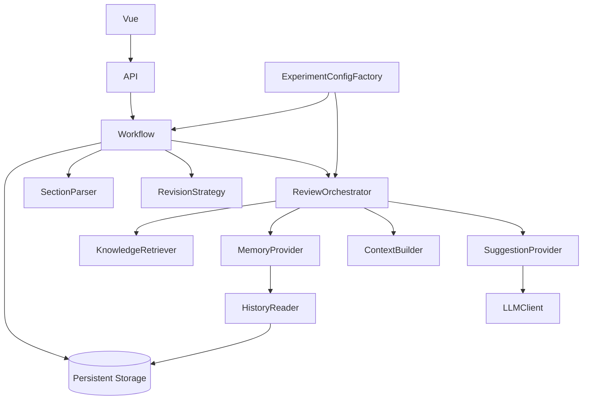

# Architecture & research boundaries

## Dependency direction



Stable core owns transactions, valid state transitions, immutable historical facts, event sequence, versions and current-state projections. Replaceable modules receive plain snapshots, not live ORM sessions. Runtime context is a selected, reproducible input snapshot; it is not the full database history. Persisting runtime context in `GenerationRecord` serves audit only and does not determine future memory selection.

## Current policies (replaceable, not research conclusions)

| Module | Default | Replace here |
|---|---|---|
| SectionParser | Lossless heading/teaching-label heuristics; no headings = one section | `providers/defaults.py` + factory registry |
| SuggestionProvider | Mock or Generic LLM, 0–2 candidates, invalid output rejected | `providers/llm.py` / config |
| KnowledgeRetriever | Dummy returns `[]` | New retriever + config |
| MemoryProvider | Latest section + this section's rejected suggestions | New memory provider + config |
| ContextBuilder | Metadata + section + memory + knowledge + optional inquiry | New builder + config |
| InquiryProvider | Disabled, reserved `CustomPrompt` entity | New provider + separate inquiry service |
| RevisionStrategy | Append independent activities to latest section content | New strategy + versioned config |
| ExperimentConfig | One versioned `DEFAULT_DEMO_CONFIG` | `providers/config.py` |

There are no condition-name checks in routes or orchestration. DeepSeek and Zhipu share the transport; only base URL, model and key configuration differ. Model `pedagogical_basis` is separate from retrieval items and carries an explicit `basis_type`. `KnowledgeItem` is a typed DTO; future repository tables, ExperimentCondition and SystemConfig can be added with new migrations. The present session snapshot is not a prematurely fixed experimental assignment system.

## Persistence

Participant → Session → LessonPlan, Rounds. LessonPlan → Sections, LessonPlanVersions. Section → SectionVersions. Each (Round, Section) has a unique SectionReview, including successful zero-suggestion generation and completion time. GenerationRecord references the exact input SectionVersion. Suggestions reference the generation and round/section; Decisions reference the suggestion and session. RetrievalRecord, CustomPrompt and InteractionEvent preserve research process data.

`Session.current_section_id` is a projection maintained by the workflow, intentionally not a circular foreign key. Parent sections are schema-ready but the default parser produces a flat segmentation. There is no automatic resegmentation between rounds; changing segmentation later requires a versioned section-identity policy.

History is append-only through the public API; database administrators can still change data. This is traceability, not cryptographic tamper evidence. Never modify old migration files after release.

## State machine

```text
CREATED -- atomically persist original + parse + initialize --> ACTIVE
ACTIVE -- all sections generated, decided, completed --> ROUND_COMPLETED
ROUND_COMPLETED -- continue, N < 5 --> ACTIVE (N + 1)
ROUND_COMPLETED -- terminate --> TERMINATED
```

Creation records CREATED then transitions to ACTIVE in the same transaction: clients never see a half-created lesson. Completion writes the round snapshot before exposing ROUND_COMPLETED, not only when Continue is pressed. Termination is limited to round boundaries; unfinished rounds remain recoverable and are not mislabeled as complete.

## Consistency and idempotency

- Session mutation uses PostgreSQL `SELECT FOR UPDATE`. SQLite uses `BEGIN IMMEDIATE` and serializes writers for the small local demo.
- Generation, decision, projection update, version and event are atomic. The bounded model request holds the session transaction in this MVP. Another request cannot generate a second suggestion set or apply stale data concurrently.
- Creation keys are UUIDs with a payload hash. Sequential repeats return the same session; concurrent key conflicts return 409, and retry recovers the winning session.
- Suggestion decisions have a unique database constraint. Repeating the same decision is idempotent; attempting to change it returns 409.
- Navigation and Continue include an explicit round ID and section ID; retry cannot advance an additional section/round.
- Failed model calls commit a failure record while leaving the review ungenerated. Model output over 2 suggestions, empty required fields, invalid JSON, truncation or refusal is rejected as a whole.
- No revision version is added for a no-op strategy application; the ACCEPT decision remains logged.
- Event sequence numbers are assigned under the same session lock. Export can replay ordered SECTION_UPDATED version references; tests reconstruct final content this way.

## API

All paths prefixed `/api`. `/docs` provides OpenAPI. Session creation atomically combines the suggested create/submit/parse APIs to avoid orphaned or partially initialized state.

| Method / path | Role |
|---|---|
| GET `/health` | DB connectivity and provider/key presence (never key contents) |
| POST `/sessions` | metadata + content + UUID request_key |
| GET `/sessions/{id}/current-state` | complete recovery snapshot |
| POST `/sessions/{id}/view` | client acknowledgement of rendered section |
| POST `/sessions/{id}/suggestions` | round_id + section_id |
| POST `/sessions/{id}/suggestions/{suggestion_id}/decision` | ACCEPT / REJECT |
| POST `/sessions/{id}/complete-section` | complete explicit section; final section closes round |
| POST `/sessions/{id}/rounds/{round_id}/continue` | next round, up to 5 |
| POST `/sessions/{id}/terminate` | finish at round boundary |
| GET `/sessions/{id}/final` | terminated final state |
| GET `/sessions/{id}/export` | entire historical JSON, schema_version=1 |
| POST `/sessions/{id}/custom-prompt` | 403 in current disabled configuration |

## Known tradeoffs / extension risks

1. **Long database transaction during LLM calls.** Simple, correct serialization for a small demo; PostgreSQL permits other sessions to proceed. Before larger pilots, use a durable generation job with lease, input-version comparison and separately committed request/result stages. If the process dies during a model call, DB rolls back and a retry may call the vendor again. External-call exactly-once is not promised; abandoned in-flight responses are not saved.
2. **Heading detection is provisional.** Generic numbered exercises are not blindly split. Empty heading sections are retained. Input slices concatenate exactly to V0. A future parser may require human confirmation and section lineage before use in a study.
3. **Append strategy is provisional.** It preserves original content and composes two accepts safely, but may produce repetition or inconsistencies. A rewrite/patch strategy needs source-version preconditions and conflict handling; do not replace append behavior silently in old configs.
4. **Memory scope is deliberately small.** Same-section rejections only, no global lesson text or summaries. Persisted input remains complete. Add relevant lesson context through a reader/builder when the study defines it.
5. **Config versioning is explicit.** Old snapshots must keep a supported factory registration. API keys are not frozen; switching between multiple vendors simultaneously needs a credential resolver.
6. **Human judgement and inquiry are not frozen.** CustomPrompt table and interface are reserved; no experimental allocation, rubric or teacher-growth inference is implemented.
7. **Small-demo API shape.** Current-state includes all current-round sections and suggestions; many sections increase response size. Later introduce projections/pagination without changing history schema.
8. **Operational environment.** SQLite is for easy local trials. PostgreSQL uses JSONB and migrations, but must be exercised against the deployment instance before research use. Back up the database and record a code commit alongside exported session configuration for each study run.
